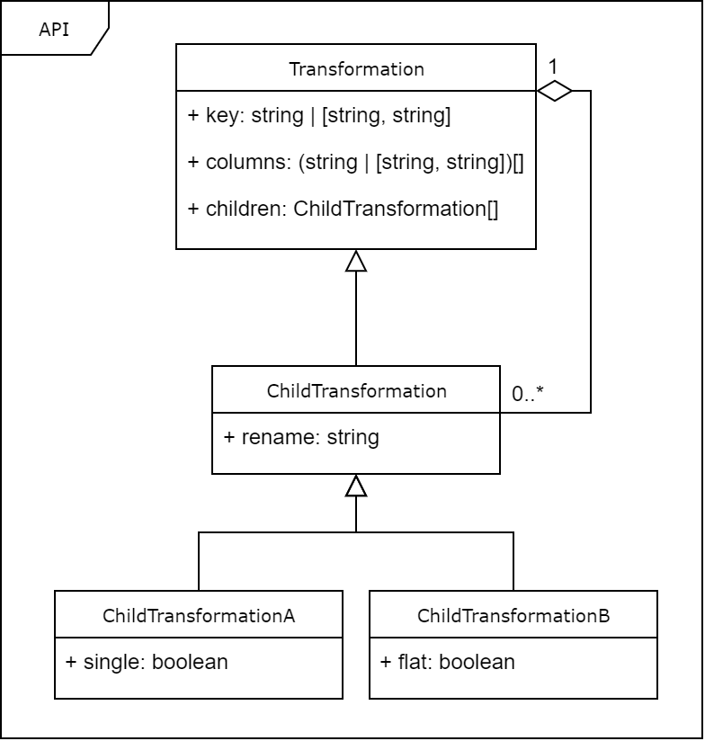

# The Transformer API

## What does it do?
It offers a declarative way to express how your query results
should look like, then it does the magic for you. Sounds simple, right?

It's a way to specify transformations (hence the name) to be applied to
your query results, primarily to get back structured objects instead of a plain recordset.
Although it can serve a similar purpose in some cases, this is a different approach to what
full-fledged ORMs do, and **this is not an ORM**.

The primary use case is applications where structured query results are desired, but having
a bunch of class definitions and such is not. With this, all you gotta do is follow the API
to specify what the result should look like, and rest assured it'll do that for you. No model
classes. No ORM anything. Just magic.

It is important to note that the schema of the database is not taken into consideration.
It really doesn't matter. What does matter is the schema of that resulting query.
That means: if you want a transformation to be based on some column, it better be part
of that recordset.

## What it does NOT do

It won't make you coffee, and it surely won't help you map the transformed results back to
a recordset. It won't offer any `.save()` or `.persist()` methods. Remember: **it's not an ORM**.
If you need that kind of functionality, this is not the right tool for the job.

But, for just a second, take a break and think: "Do I really need an ORM?". I find that oftentimes
people overuse ORMs, just because it's common practice.

## In action

PostgreSQL and MySQL
```js
const transformer = require('sqlutils/pg/transformer'); //or require('sqlutils/mysql/transformer');

const rows = [ //in real-world applications this would be the result of a database query
    { ssn: 'abcd', name: 'John Doe', email: 'john@example.com' },
    { ssn: 'abcd', name: 'John Doe', email: 'john@acme.com' },
    { ssn: 'defg', name: 'Jimmy', email: 'jimmy@example.com' },
];

const employees = transformer(rows, {
    key: 'ssn',
    columns: ['name'],
    children: [{
        key: ['email'],
        rename: 'emails',
        flat: true
    }]
});

console.log(employees);
/*
[
    { ssn: 'abcd', name: 'John Doe', emails: ['john@example.com', 'john@acme.com' ] },
    { ssn: 'defg', name: 'Jimmy', emails: ['jimmy@example.com'] }
]
*/
```

## The API

For those of us who like UML diagrams, here it goes:



For the rest of us, there's really not much to it. A transformation is always specified
as a regular JavaScript object with a specific structure. That is the root transformation.
Each transformation can have their own child transformations, that also have that same
structure (albeit with some spices that we'll get into in a second).

So there are three main properties a transformation can have: `key`, `columns` and `children`.

### key

The `key` property can be understood as the column name for a (primary/foreign) key in that
recordset. Make no mistake, though, because as I said earlier, the database schema doesn't matter.
Don't mistake a key of the recordset for a database (primary) key.

By key I mean any column that will act as a key in the recordset. For the root transformation,
that means it's unique within the recordset (eg. its values won't be repeated across multiple rows).
For any child transformation, that means it's a column that was used in a JOIN (or similar) clause.

If you're mesmerized wondering why, it's not that complex. Key columns serve as anchors for each
transformation. So you've got to pick columns that represent the reason why data repeats in the
recordset, so that the deduplication magic can take place.

The `key` property should always be present in any transformation. It can be either
a string containing the name of the column in the recordset, or an array containing
two string elements: the name of the column in the recordset and the new name
that the column should have in the final result. That is, the array variant can be used
to rename a column. Its second element can also be ommited or null, to specify that
the column shouldn't be present in the final result.

### columns

The `columns` property specifies the names of all columns that should sit next to the `key`
column in the final result. The column specified in the `key` property is already assumed
to be present and thus should not be specified again here.

The `columns` property should always be present in any transformation. As you'd expect,
it's an array of columns. Its elements can be either strings, arrays containing two
strings each (to support renaming, like with the `key` property) or a mix of both.

### children

The `children` property is optional. It allows child transformations to be specified.
It's specified as an array of child transformations. Child transformations look just
like regular transformations, but with some extra spices. They can have three extra
properties: `rename`, `single` and `flat`.

### rename

The `rename` property should always be present in child transformations, as it specifies
the name of the property that will contain the result of the transformation in its
parent. Thus, that's why root transformation don't have this property: they have no parent
transformation.

It's just a string.

### single

The `single` property is optional. By default child transformation result in an array
being present in the parent, at the property specified by the `rename` property.
However, sometimes that array will always have at most one element, and it might be
desirable not to have an array wrapping that single element. That's what the `single` property
is for: it allows you to specify that the array would have at most one element, and thus you
don't want the array wrapping it. In case there's no element, instead of an empty array it'll
be null.

(the `single` property is, of course, cannot be present in the root transformation as it has no parent)

The `single` property can be useful when working with one-to-one relationships. It's either
true or false. When not specified, it's assumed to be false.

The `single` and `flat` properties cannot simultaneously be present in a given child transformation.
That would result in just a regular column being present in the parent, which you can do by simply not
messing with child transformations and instead just adding that column to the `columns` property of
the parent. As you see, it makes no logical sense, and thus, is forbidden by design.

### flat

The `flat` property is optional. By default child transformations result in an array of objects
being present in the parent, at the property specified by the `rename` property. However, sometimes
a transformation will result in only one column being present in those objects, and it might be
desirable not to have an object wrapping that column. That's what the `flat` property is for:
it allows you to specify that you don't want an object wrapping that column, thus the result will
contain an array of whatever type the column has.

(the `flat` property is, of course, cannot be present in the root transformation as it has no parent)

The `flat` property can be useful when working with multivalued columns in normalized databases
(A.K.A one-to-many relationships: the old school way of implementing arrays). It's either true or false. When not specified, it's assumed to be false.

The `single` and `flat` properties cannot simultaneously be present in a given child transformation.
That would result in just a regular column being present in the parent, which you can do by simply not
messing with child transformations and instead just adding that column to the `columns` property of
the parent. As you see, it makes no logical sense, and thus, is forbidden by design.

## Usage example

PostgreSQL and MySQL
```js
const transformer = require('sqlutils/pg/transformer'); //or require('sqlutils/mysql/transformer');

const rows = [ //in real-world applications this would be the result of a database query
    { id: 1, name: 'Alice', sale_id: 1, sale_price_paid: 10.5, sale_item_code: 1, sale_item_name: 'A' },
    { id: 1, name: 'Alice', sale_id: 1, sale_price_paid: 10.5, sale_item_code: 2, sale_item_name: 'B' },
    { id: 1, name: 'Alice', sale_id: 2, sale_price_paid: 5.5, sale_item_code: 3, sale_item_name: 'C' },
    { id: 1, name: 'Alice', sale_id: 2, sale_price_paid: 5.5, sale_item_code: 4, sale_item_name: 'D' },
    { id: 2, name: 'Bob', sale_id: 3, sale_price_paid: 7.5, sale_item_code: 5, sale_item_name: 'E' },
    { id: 2, name: 'Bob', sale_id: 4, sale_price_paid: 15.5, sale_item_code: 6, sale_item_name: 'F' },
];

const customers = transformer(rows, {
    key: 'id',
    columns: ['name'],
    children: [{
        key: ['sale_id', 'id'],
        columns: [
            ['sale_price_paid', 'price_paid'],
        ],
        rename: 'sales',
        children: [{
            key: ['sale_item_code', 'code'],
            columns: [ ['sale_item_name', 'name'] ],
            rename: 'items',
        }]
    }]
});

console.log(customers);
/*
[
    {
        id: 1,
        name: 'Alice',
        sales: [
            { id: 1, price_paid: 10.5, items: [ { code: 1, name: 'A' }, { code: 2, name: 'B' } ] },
            { id: 2, price_paid: 5.5, items: [ { code: 3, name: 'C' }, { code: 4, name: 'D' } ] },
        ]
    },
    {
        id: 2,
        name: 'Bob',
        sales: [
            { id: 3, price_paid: 7.5, items: [ { code: 5, name: 'E' } ] },
            { id: 4, price_paid: 15.5, items: [ { code: 6, name: 'F' } ] },
        ]
    }
]
*/
```

## Tips

Although the docs are still not as good as I'd like them to be, by now you should have
a decent understanding about the library, enough to use it. In case you're still not
confident enough, I encourage you to just grab it, play with it a little bit to try
and get a better understanding of what each option does. It should become clear
through experimentation, because each and every option has a clear impact on the
resulting objects.

I'll be revisiting this page in the future to expand it and further improve it with
toy examples that should, hopefully, make it even better.